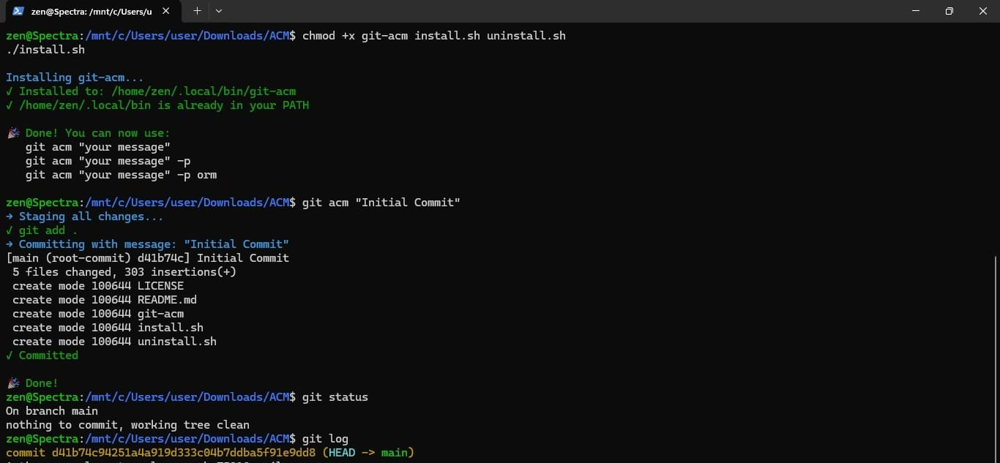

# git-acm

`git-acm` is a small Git helper for the most common workflow: add, commit, and optionally push.

If you are tired of typing the same three commands every time, this keeps it simple.

```bash
git add .
git commit -m "message"
git push
```

becomes:

```bash
git acm "message" -p
```

## Commands

- `git acm "message"`
Stages everything and creates a commit.

- `git acm "message" -p`
Stages, commits, then pushes.

- `git acm "message" -p orm`
Stages, commits, then runs `git push -u origin main` (useful for first push).

## Install

1. Clone the repo:

```bash
git clone https://github.com/YOUR_USERNAME/git-acm.git
cd git-acm
```

2. Make scripts executable:

```bash
chmod +x git-acm install.sh uninstall.sh
```

If you are skeptical about `chmod` in the command, copy-paste the code into any AI and ask whether it is harmful or not.

3. Run installer:

```bash
./install.sh
```

### Demo (Install + Working)



The installer copies `git-acm` to `~/.local/bin/` (or `/usr/local/bin/`) and marks it executable.

4. If needed, add this to your shell config (`~/.bashrc` or `~/.zshrc`):

```bash
export PATH="$HOME/.local/bin:$PATH"
```

Reload shell:

```bash
source ~/.bashrc
# or
source ~/.zshrc
```

5. Verify:

```bash
git acm --help
```

## Examples

```bash
# Stage + commit
git acm "fix: typo in README"

# Stage + commit + push
git acm "feat: add login page" -p

# First push to origin/main (sets upstream)
git acm "initial commit" -p orm
```

## Uninstall

```bash
./uninstall.sh
```

You only need the `chmod` step once.

## Why this works

Git treats executables named `git-<name>` as subcommands. So if `git-acm` is in your `PATH`, `git acm` works automatically.

## License

MIT
